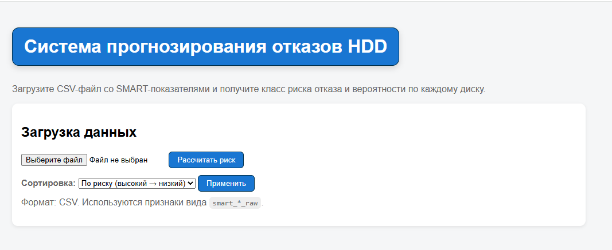
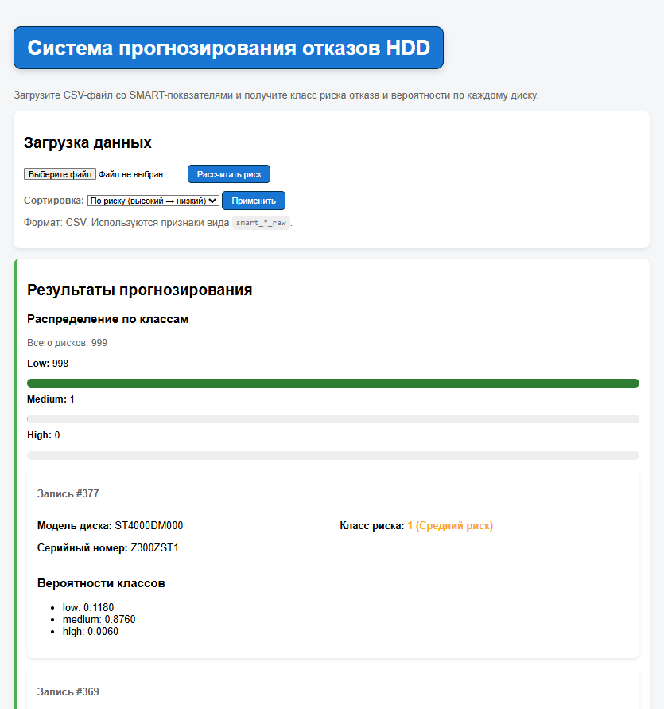

# disk-failure-prediction-ml
Прогнозирование выхода из строя дисков 
# SMART Failure Prediction (HDD) — ML Prototype

Прототип для преддипломной практики и ВКР по теме: **"Прогнозирование неисправности компьютерных компонентов методами машинного обучения"**.

Фокус проекта — **прогнозирование отказов накопителей (HDD)** на основе диагностических **SMART** показателей.

## Назначение

Система выполняет оценку класса риска отказа накопителя на основе SMART-атрибутов и обученной ML-модели.

Поддерживаются два режима работы:

- CLI **disk-tool** (командная строка)
- WEB-интерфейс **disk-tool-web** (демонстрационный)

---

## Поддерживаемая среда

- **REDOS 7**
- **Python 3.8**
- **smartmontools** (для сбора SMART)

---

### СКАЧИВАНИЕ МОДЕЛИ
**скачать модель можно на вкладке доступных релизов чтобы не испытывать проблем с GIT LFS**
**поместить ее по пути в проекте ./models/**

## Быстрая установка (REDOS 7)
### 1. Установить smartmontools
```bash
dnf install smartmontools
```
### 1. Перейти в каталог проекта
```bash
cd ~/disk-failure-prediction-ml
```
### 2. Создать виртуальное окружение:
```bash
python3.8 -m venv .venv
```
### 3. Активировать окружение:
```bash
source .venv/bin/activate
```
### 4. Обновить инструменты сборки:
```bash
pip install --upgrade pip setuptools wheel
```
### 5. Установить проект:
```bash
pip install -e .
```

После установки становятся доступны команды:
- **disk-tool**
- **disk-tool-web**

### CLI режим
**disk-tool detect** - Обнаружение HDD в системе исключая USB
**disk-tool collect** - Использование smartctl для сбора smart данных
**disk-tool parse --log path/to/smart_file.txt** - Парсинг лога
**disk-tool predict --csv path/to/file.csv** - Предсказане риск класса
**disk-tool predict-local** - Полный цикл все в одном

### WEB режим
**disk-tool-web** - запускает сервер зайти можно по 127.0.0.1:5000 и сразу же загрузить csv файл для выявления риск класса
### Пример выполнения


